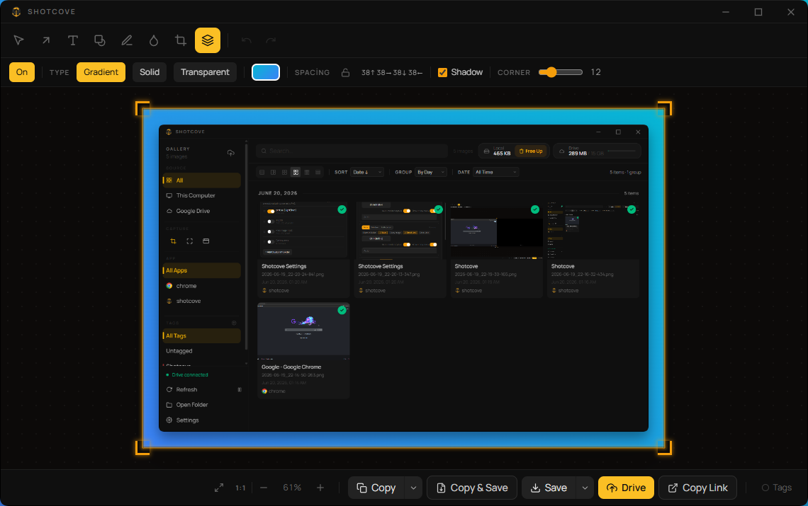
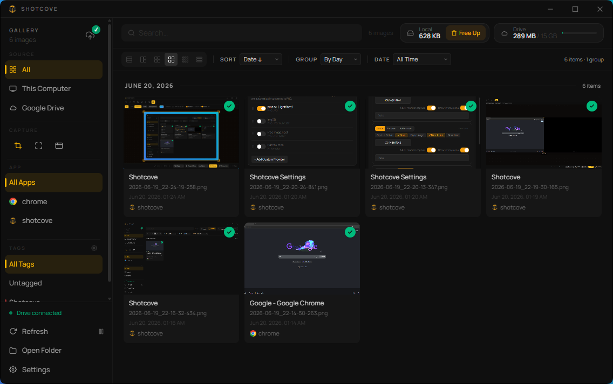
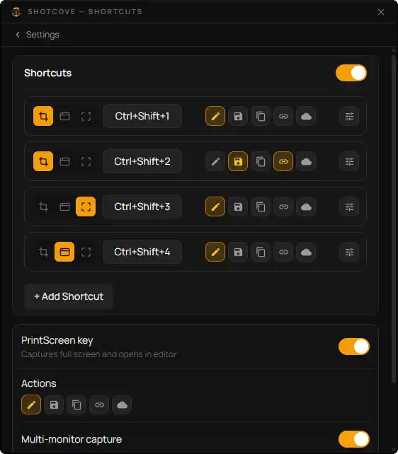
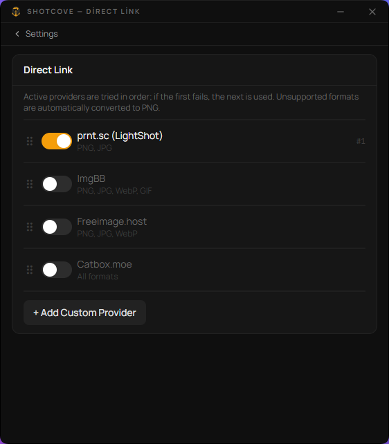

<div align="center">
  
  <h1>Shotcove</h1>
  <p>Screenshot tool with a built-in editor and automatic Google Drive sync, built with Tauri 2 + React</p>

  [](LICENSE)
  [](https://github.com/xacnio/shotcove/releases)
  [](https://xacnio.github.io/shotcove/)

  <a href="https://apps.microsoft.com/detail/9P3T7Q4B3PXZ?launch=true&mode=full" target="_blank">
    
  </a>
</div>

---

Shotcove lives in your system tray. Hit a shortcut to capture an area, a window, or the full screen — the shot opens in a built-in editor, then copies, saves, or uploads itself to Google Drive or a Direct Link provider on its own.

## Screenshots

<div align="center">
  
</div>

<details>
<summary><b>✨ Click here to view more screenshots</b></summary>
<br>

| Gallery | Shortcuts |
| :---: | :---: |
|  |  |

**Direct Link providers**



</details>

## Features

**📸 Capture**
- Fully customizable shortcuts — combo, capture mode (area, window, full screen, current monitor) and actions, per slot
- PrintScreen support out of the box, as a dedicated full-screen shortcut
- Multi-monitor aware — capture spans every display, or just the one under your cursor
- Elevated/admin mode — shortcuts keep working with apps running as administrator

**🖌️ Editor**
- Arrow, text (custom Google Fonts), 8 shape types, freehand pen, blur/pixelate, and crop (by window or by monitor)
- Gradient backgrounds, color palette, adjustable stroke width, layering (bring forward / send back)
- Full undo/redo and zoom
- One-click Copy, Save, Copy & Save, Drive upload, or Direct Link from the toolbar

**☁️ Cloud Sync**
- Automatic background sync to a dedicated Google Drive folder — already-uploaded files are tracked and never re-sent
- Full / Local-priority / Manual sync modes
- No backend — Shotcove talks to Drive directly from your machine. OAuth tokens are stored in your OS credential store (Windows Credential Manager, macOS Keychain, Linux Secret Service) and never sent anywhere else

**🔗 Direct Link Sharing**
- Skip Drive entirely: upload to ImgBB, Catbox, or any custom HTTP endpoint you configure
- Multiple providers tried in priority order; unsupported formats are automatically converted to PNG

**🖼️ Gallery**
- Unified view of local and Drive-synced screenshots
- Filter by date, source app, source, or tag; sort and group
- Free up local disk space without losing the cloud copy
- Tagging system, multiple grid/list view modes

**🌍 Internationalization**
- English and Türkçe, fully localized interface

**💻 Platform Integration**
- Lives in the system tray, with optional autostart
- Built-in auto-updater

## Install

Grab the latest build from [Releases](https://github.com/xacnio/shotcove/releases). Pick the badge that matches your machine — **x64** is the regular Intel/AMD build, **ARM64** is for ARM-based PCs and Macs/Linux boards.

**🪟 Windows (10+)**

[](https://github.com/xacnio/shotcove/releases/latest)

[](https://github.com/xacnio/shotcove/releases/latest)

Or get it from the Microsoft Store:

<a href="https://apps.microsoft.com/detail/9P3T7Q4B3PXZ?launch=true&mode=full" target="_blank">
  
</a>

**🍎 macOS (11+)**

[-000000?style=for-the-badge&logo=apple&logoColor=white)](https://github.com/xacnio/shotcove/releases/latest)

**🐧 Linux**

[](https://github.com/xacnio/shotcove/releases/latest)

[](https://github.com/xacnio/shotcove/releases/latest)

## Build from source

```bash
git clone https://github.com/xacnio/shotcove
cd shotcove
npm install
npm run tauri dev    # development
npm run tauri build  # installer package (NSIS/MSI)
```

Requires [Rust](https://rustup.rs/), [Node.js](https://nodejs.org/), and platform-specific deps for Tauri — see [Tauri prerequisites](https://v2.tauri.app/start/prerequisites/).

## Using your own Google Cloud OAuth client (optional)

Shotcove connects to Google Drive out of the box using its own built-in OAuth
client — just click **Connect Google account** in Settings and you're done.
Setting up your own Client ID is only useful if you'd rather run on your own
Google Cloud quota instead of the shared default one. If that doesn't matter
to you, skip this section entirely.

1. [Google Cloud Console](https://console.cloud.google.com/) → create a new project (e.g. "Shotcove").
2. **APIs & Services → Library** → find **Google Drive API** and click **Enable**.
3. **APIs & Services → OAuth consent screen**:
   - User type: **External** → Create
   - Fill in the app name and email fields, then save.
   - Add your own Gmail address under **Audience → Test users** (unless you publish the app to "production", only test users can sign in — that's enough for personal use).
4. **APIs & Services → Credentials → Create Credentials → OAuth client ID**:
   - Application type: **Desktop app**
   - Copy both the generated **Client ID** and **Client Secret**.
5. In Shotcove's Settings window (tray icon → Settings → Advanced), paste **both** the Client ID and Client Secret → click **Connect Google account** → grant access on the Google page that opens in your browser.

> **The Client Secret field is required once you supply your own Client ID.**
> If you leave it empty, Shotcove falls back to its own built-in secret, which
> won't match your custom Client ID and Google will reject the connection
> with `invalid_client` / "The provided client secret is invalid". Fix: copy
> the Client ID and Secret together from the same OAuth client (`GOCSPX-...`)
> and paste both in.
>
> Your tokens are stored only on your own machine, in your OS credential store (see **Cloud Sync** above).

## Where are my files?

| What | Windows | macOS / Linux |
|---|---|---|
| Screenshots | `%USERPROFILE%\Pictures\Shotcove` | `~/Pictures/Shotcove` |
| Settings | `%APPDATA%\dev.xacnio.shotcove\settings.json` | macOS: `~/Library/Application Support/dev.xacnio.shotcove/settings.json` · Linux: `~/.config/dev.xacnio.shotcove/settings.json` |
| Upload record | `%APPDATA%\dev.xacnio.shotcove\uploaded.json` | same base path as Settings, `uploaded.json` |
| Drive tokens | Windows Credential Manager | macOS Keychain / Linux Secret Service |

The screenshots folder is configurable in Settings on every platform.

## How it works

- Pressing a shortcut freezes the screen on the monitor under your cursor and opens a full-screen selection overlay; drag to select an area (Esc or right-click to cancel).
- After selection, the image opens in the editor. Save/Share writes it to disk as `Date_Time.png` and queues it for upload.
- The screenshots folder is also watched at the filesystem level: PNG/JPG files you drop in manually get uploaded automatically too.
- On the "Link" shortcut, once the file is uploaded it's set to *anyone with the link can view* and its `webViewLink` is copied to your clipboard.

## Disclaimer

Shotcove integrates with third-party services — Google Drive, ImgBB, and Catbox — for cloud sync and link sharing. It is not affiliated with or endorsed by any of them. You can connect your own accounts/API keys, and you're responsible for the content you upload through these services and for complying with their terms of use.

## Built with

| Project | Description | License |
| :--- | :--- | :--- |
| [Tauri](https://tauri.app) | Lightweight desktop app framework | MIT / Apache-2.0 |
| [React](https://react.dev) | UI library | MIT |
| [Tailwind CSS](https://tailwindcss.com) | Utility-first CSS framework | MIT |
| [Vite](https://vitejs.dev) | Frontend build tool | MIT |
| [react-icons](https://react-icons.github.io/react-icons) | Icon components | MIT |
| [TanStack Virtual](https://tanstack.com/virtual) | Virtualized lists/grids | MIT |
| [Manrope](https://manropefont.com) | UI font | OFL-1.1 |
| [Tokio](https://tokio.rs) | Async runtime | MIT |
| [reqwest](https://github.com/seanmonstar/reqwest) | HTTP client | MIT / Apache-2.0 |
| [xcap](https://github.com/nashaofu/xcap) | Cross-platform screen capture | MIT |
| [image-rs](https://github.com/image-rs/image) | Image encoding/decoding | MIT / Apache-2.0 |
| [serde](https://serde.rs) | Serialization framework | MIT / Apache-2.0 |
| [notify](https://github.com/notify-rs/notify) | Filesystem watcher | MIT / Apache-2.0 |
| [keyring-rs](https://github.com/open-source-cooperative/keyring-rs) | Cross-platform OS credential store access | MIT |

## AI Disclosure

This project was developed with the assistance of AI-powered coding tools (Claude and similar LLM-based agents) to speed up the path to a first stable release. All generated code was reviewed and guided by the developer's own software engineering judgment throughout.

Going forward, maintenance, stability improvements, and new features will be driven primarily through conventional development practices, with AI tools used only as supplementary aids where appropriate.

## License

[MIT](LICENSE)

## Privacy Policy

[Privacy Policy](PRIVACY.md) · [Terms of Service](TERMS.md)

Also published on the website: [Privacy](https://xacnio.github.io/shotcove/privacy.html) · [Terms](https://xacnio.github.io/shotcove/terms.html) · [License](https://xacnio.github.io/shotcove/license.html)
